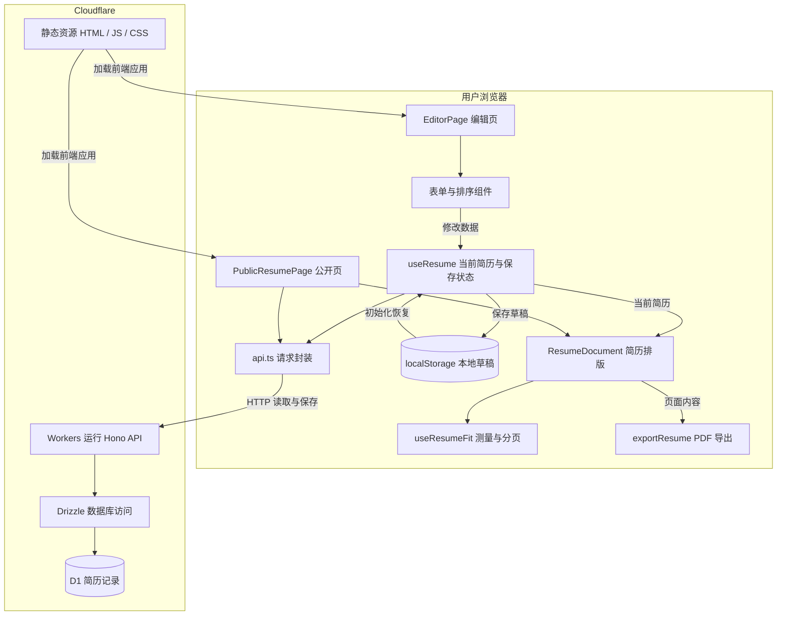
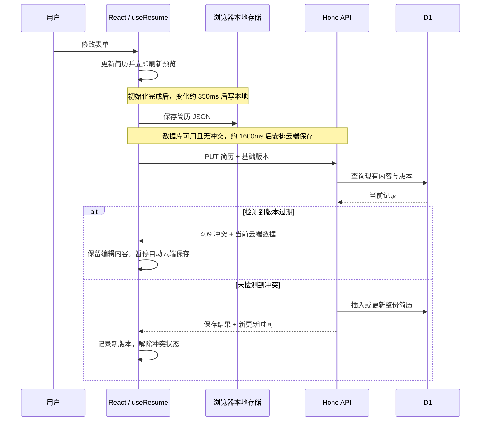
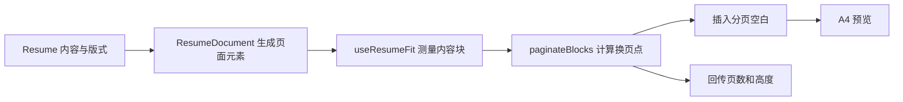

# 一纸简历：技术架构与代码脉络

> **版本说明（2026-09-29）：当前已改为纯浏览器本机存储。** 登录、注册、云端同步和公开分享已移除；网页预览读取本机当前稿，JSON 用于迁移与备份。清空浏览器数据后回到样例模板。下文的云端、账号、D1 与冲突流程为历史版本设计，不能作为当前功能说明；当前操作以[使用指南](guide.md)为准。

[文档首页](../README.md) · [使用与开发](guide.md) · [面试准备](project-experience.md)

**本页目录**

- [1. 项目是什么](#chapter-1)
- [2. 整体结构：代码在哪里运行](#chapter-2)
- [3. 目录与模块：每层管什么](#chapter-3)
- [4. 数据模型：内容、版式和保存状态要分清](#chapter-4)
- [5. 一次编辑如何走过系统](#chapter-5)
- [6. 云端接口与冲突处理](#chapter-6)
- [7. 公开页从哪里拿数据](#chapter-7)
- [8. 排版：把简历数据变成纸张内容](#chapter-8)
- [9. 导出：同一内容，两条输出路径](#chapter-9)
- [10. 模板、构建与部署](#chapter-10)
- [11. 当前限制与后续方向](#chapter-11)
- [12. 测试与阅读顺序](#chapter-12)

本文已于 2026-09-29 按体验改进更新保存、恢复、预览和测试相关章节。先解释系统如何运转，再定位到代码；“后续改进”与已实现功能分开说明。面试口述和名词详解见 [项目经历与面试准备](project-experience.md)。

<a id="chapter-1"></a>

## 1. 项目是什么

一纸简历是独立开发的在线简历工具。用户填写经历、调整顺序和版式，浏览器即时生成预览；内容可以保存到本机和云端，也可以通过链接展示或导出 PDF。

理解架构先记住三件事：

1. **一份数据驱动界面。** 表单修改当前简历数据，预览根据这份数据更新。
2. **一套组件负责排版。** 编辑预览和公开页共用 `ResumeDocument`，导出也从它生成的页面内容开始。
3. **显示与保存分开。** 预览立即更新；本地和云端保存稍后执行，网络速度不决定输入反馈速度。

当前支持独立账号和草稿归属校验，不支持多人协作编辑或服务端 PDF 生成。它是同一仓库中的前端应用加后端接口，不是多个独立微服务。

<a id="chapter-2"></a>

## 2. 整体结构：代码在哪里运行



前端在浏览器运行，负责交互、排版和导出。后端在 Cloudflare Workers 运行，负责接收请求、读写数据库和比较版本。D1 负责长期存储数据。

**HTTP** 是浏览器和后端交换请求、响应的协议；**API** 是双方约定的请求入口；**静态资源**是打包后的页面、脚本和样式文件。

### 技术职责

| 技术 | 在项目中的职责 |
| --- | --- |
| React + TypeScript | 实现组件和状态更新，约定简历与接口数据的类型。 |
| React Router | 根据地址选择编辑页或公开页。 |
| Tailwind CSS / 专用 CSS | 前者主要用于编辑器控件，后者控制简历纸张、字体、布局和打印。 |
| Base UI / 仓库中的 UI 组件 | 提供按钮、菜单等基础交互；Lucide 提供图标。 |
| Vite | 启动本地开发服务，构建前端与 Worker。 |
| Hono | 定义后端路由，解析请求并返回响应。 |
| Drizzle ORM | 描述表结构并执行数据库读写；它是访问数据库的工具，不是数据库本身。 |
| Cloudflare Workers + D1 | 前者运行后端，后者存放简历。 |
| modern-screenshot + jsPDF | 将简历转成图片，再生成长图 PDF。A4 模式另走浏览器打印。 |
| Vitest | 验证数据处理、分页计算和保存等逻辑。 |

当前状态管理使用 React 和自定义 Hook，没有使用 Zustand；数据整理使用手写函数，没有接入 Zod。Hook 是把状态和相关行为组织在一起的 React 函数。

<a id="chapter-3"></a>

## 3. 目录与模块：每层管什么

```text
yizhi/
├── src/app/                         浏览器端
│   ├── main.tsx                     挂载 React 应用
│   ├── App.tsx                      页面地址与路由
│   ├── pages/                       编辑页、公开页的组合与流程
│   ├── components/editor/           表单、排序、列表操作
│   ├── components/resume/           简历正文展示
│   ├── components/ui/               基础控件
│   ├── hooks/useResume.ts           当前简历、初始化、本地与云端保存
│   ├── hooks/useResumeFit.ts        页面测量、分页占位、间距调整
│   ├── lib/api.ts                   浏览器请求后端的统一入口
│   ├── lib/storage.ts               本地存储和 JSON 文件操作
│   ├── lib/exportResume.ts          两种 PDF 导出路径
│   └── index.css                    页面、简历及打印样式
├── src/shared/                      共享的数据定义和基础逻辑
│   ├── schema.ts                    Resume 类型与数据规范化
│   ├── seed.ts                      从 JSON 模板构造默认数据
│   ├── paginate.ts                  只用高度数字计算分页
│   └── sync.ts                      比较保存版本是否过期
├── src/worker/index.ts              Hono 接口、版本检查和数据库操作
├── src/db/schema.ts                 Drizzle 数据表定义
├── src/test/                        自动化测试
├── public/sample-resume.json        唯一的内置简历模板
├── drizzle/                         数据库建表及迁移 SQL
├── vite.config.ts                   构建插件与路径别名
└── wrangler.toml                    Cloudflare 资源与运行配置
```

**依赖方向：** 页面组合组件和 Hook；Hook 调用 API、本地存储等工具；前后端共用数据定义；Worker 通过 Drizzle 访问 D1。`shared` 中的分页和版本判断不依赖页面，方便单独测试。

当前后端路由、数据库操作和流程判断集中在一个 Worker 文件中，没有另外拆出 service、repository 等层。当前规模下阅读路径较短；以后变复杂时再按实际职责拆分。

<a id="chapter-4"></a>

## 4. 数据模型：内容、版式和保存状态要分清

### 4.1 简历本身：Resume

[数据定义](../src/shared/schema.ts) 将简历分成内容和配置：

| 部分 | 字段举例 | 含义 |
| --- | --- | --- |
| 基本信息 | `basics.name`、`phone`、`email`、`photo` | 姓名、联系方式、照片等。 |
| 经历列表 | `education`、`experience`、`projects` | 每项有稳定 ID，保存对应内容。 |
| 其他栏目 | `skills`、`awards`、`publications`、`languages`、`customSections` | 技能、获奖等，以及用户自定义内容。 |
| 显示配置 | `meta.sectionOrder`、`hiddenSections`、`basicsOrder`、`hiddenBasics` | 栏目和联系字段的顺序、显隐。 |
| 版式配置 | `meta.layoutMode`、`headerAlign`、`fontScale`、`showPhoto` | 长图或 A4、基本信息位置、字号、照片显示。 |

隐藏字段只改显示配置，不删除原值。照片以包含图片内容的 Data URL 文本保存在 `basics.photo`，所以可以随 JSON 导入导出，代价是数据文件和请求体变大。

`layoutMode` 的取值容易混淆：`single` 表示连续长图模式，`multi` 表示 A4 分页模式；它们不直接表示内容最终一定是一页或多页。

### 4.2 数据进来时：normalizeResume

JSON 文件、浏览器草稿和数据库内容都可能缺少字段或沿用旧结构。`normalizeResume` 会整理字段类型、补默认配置和标识，并处理旧数据兼容。

TypeScript 只能帮助检查程序代码，无法证明外部文件一定正确，因此读取后仍需要这种运行时处理。目前采用的是较宽松的规范化，不是所有不合法输入都严格拒绝。用户主动留空的日期会保留，不能和“根本没提供日期”混为一谈。

### 4.3 编辑过程中：保存状态不属于简历正文

[useResume](../src/app/hooks/useResume.ts) 除了 `resume`，还管理：

| 状态 | 作用 |
| --- | --- |
| `slug` | 分享地址中的简历标识。 |
| `hydrated` | 初始化读取流程是否结束，用于控制何时开始自动保存。 |
| `dbAvailable` | 初始健康检查得到的数据库可用状态。 |
| `cloudUpdatedAt` | 当前记住的云端更新时间，保存时作为版本条件。 |
| `cloudConflict` | 是否已检测到保存冲突；为真时暂停自动云端保存。 |
| `saving` | 控制“保存中”提示和手动保存按钮。 |

编辑页还自己管理当前选中的表单、侧栏开关、预览缩放和导出状态。这些是界面状态，无需写进简历 JSON。

### 4.4 数据库如何保存

[resumes 表](../src/db/schema.ts) 一份简历对应一行：

| 字段 | 约束与用途 |
| --- | --- |
| `id` | 主键，内部唯一标识。 |
| `slug` | 非空、唯一，用于分享地址。 |
| `data` | 非空文本，保存整份简历的 JSON。 |
| `updated_at` | 非空文本，保存更新时间并参与版本比较。 |

整份 JSON 适合当前整份读写的操作方式，也方便扩展栏目。后续如果需要跨简历按公司、技能做大量筛选统计，需要重新考虑字段拆分和查询设计。

<a id="chapter-5"></a>

## 5. 一次编辑如何走过系统

### 5.1 打开编辑器

[App.tsx](../src/app/App.tsx) 定义 `/` 和 `/editor` 进入编辑器，`/resume` 进入默认公开页，`/r/:slug` 进入指定公开页。

编辑器初始化按以下顺序执行：

1. 读取 `yizhi:workspace:v2`，其中保存稳定草稿 ID、当前选择、各份内容、基础云端版本、最近同步内容及恢复点。
2. 没有新版记录时兼容读取旧 `yizhi:draft` / `resume-studio:draft`，保留旧值；没有任何草稿则显示新建入口，不读取别人的默认云端记录。
3. 检查 D1。只有绑定云端记录的草稿才读取对应内容；旧草稿缺少基础版本且内容不同时进入冲突状态，不能把新时间戳配给旧内容。
4. 新版存储损坏时保留原始记录并显示错误，阻止自动覆盖。独立的本地保存状态说明写入是否成功。

### 5.2 修改手机号、排序或隐藏内容

表单更新 `resume.basics.phone`；拖动更新顺序数组；显隐更新隐藏字段列表。React 收到新状态后，重新生成预览。

[SortableList](../src/app/components/editor/SortableList.tsx) 用指针按下、移动和松开事件处理排序。移动时选择离指针最近的行中心，生成新数组；稳定 ID 用于跟踪条目，Ref 用于读取拖动过程中的最新列表。停止拖动后清理事件监听。

编辑页的预览缩放只用于适应屏幕。简历本身仍按纸张宽度排版，缩放比例不当作用户字号保存。

### 5.3 本地与云端保存



这里的等待是**防抖**：连续输入会取消旧定时器，等短暂停顿再执行。两条保存流程独立安排，图中不表示云端一定等本地写入成功后才开始。

`draftStore.ts` 负责新版草稿容器和恢复点。整个容器一次写入 localStorage，避免内容与基础版本分开写入；旧键作为迁移来源保留。浏览器配额不足时报告失败，保留上次成功记录。每份草稿最多 5 个恢复点，总恢复点体积按 UTF-16 字符估算限制为 2 MiB。

`useResume` 保持每份草稿的内存撤销历史，并串行发送云端保存；用内容与地址组合判断是否已同步。请求返回时只确认该次发送的内容，期间的新编辑仍待同步。页面隐藏、路由卸载时尝试刷新本地保存；浏览器崩溃和系统强制终止仍不能保证末次修改写入。

<a id="chapter-6"></a>

## 6. 云端接口与冲突处理

### 6.1 接口职责

[api.ts](../src/app/lib/api.ts) 统一处理浏览器请求；[worker/index.ts](../src/worker/index.ts) 接收并处理请求。

| 接口 | 行为 |
| --- | --- |
| `GET /api/health` | 返回服务状态和 D1 是否可用。 |
| `GET /api/resumes` | 登录后返回当前账号的简历列表。 |
| `GET /api/resumes/:id` | 登录后按 ID 读取自己的草稿。 |
| `PUT /api/resumes/:id` | 验证归属、规范化输入、条件更新草稿。 |
| `GET/PUT/DELETE /api/resumes/:id/share` | 读取分享状态、发布快照或停止分享。 |
| `GET /api/public/:slug` | 仅返回已发布且有效的过滤快照。 |

`GET` 用来读取，`PUT` 用来保存。保存成功返回记录及更新时间，新建返回 201；版本冲突返回 409。未认证返回 401，其他账号的草稿返回 404，数据库不可用返回 503；不自动创建或公开示例。

`initializeSchema` 幂等创建账号草稿、发布快照与旧地址授权表。Worker 使用 D1 参数化 SQL，Drizzle schema 保留表定义；旧 resumes 表不再作为公开接口的数据源。

### 6.2 版本检查解决什么问题

两个页面都读到旧简历，A 先保存，B 随后提交整份旧内容，可能覆盖 A 的修改。B 因此需要带上“自己从哪个版本开始编辑”的信息。

当前版本就是更新时间。客户端把它放进请求体 `baseUpdatedAt` 和请求头 `If-Match`；服务端优先取请求体字符串，否则取请求头，交给 [sync.ts](../src/shared/sync.ts) 比较。

`If-Match` 可以理解为“版本匹配时再修改”的条件。本项目使用自己的时间戳约定和 409 响应，没有实现完整 ETag 条件请求；ETag 是服务端标记资源版本的一种机制。

冲突后，前端不会用响应里的云端内容覆盖当前状态。本地草稿仍按自己的流程保存，自动云端保存暂停。冲突对话框提供比较、下载、采用云端和覆盖。覆盖通过显式 `force: true` 表达；替换前创建恢复点，仍不做字段级自动合并。数据库更新使用 `WHERE id = ? AND updated_at = ?` 并检查返回行数，防止两个请求同时通过预检查后互相覆盖。同毫秒写入也推进版本时间。

### 6.3 失败结果如何传到界面

API 客户端把保存结果整理成 `saved`、`conflict`、`error`，Hook 再转为 `ok`、`conflict`、`local`、`error`，并独立管理本机写入、云端等待、正在同步、同步失败及冲突状态。

`readResume` 区分找到、404 和网络/服务错误；请求带超时。公开页对网络或服务错误提供重试，不把它们标成简历不存在。

<a id="chapter-7"></a>

## 7. 公开页从哪里拿数据

[PublicResumePage](../src/app/pages/PublicResumePage.tsx) 不使用编辑器的 `useResume`，而是自行读取分享地址对应的数据：

1. 请求 `/api/public/:slug`，仅显示发布快照，不读取完整草稿。
2. 404 显示链接不存在，410 显示停止分享；网络和服务错误显示重试入口。
3. 不再从访客本机草稿回退，不显示指向不相关本机稿的“编辑”按钮。

公开页和编辑器共用 `ResumeDocument`。公开页适应屏幕并可缩放；编辑器的当前稿预览保留原编辑状态，不访问云端。

邮箱认证由 Supabase Auth 负责；Worker 向认证服务核验令牌与邮箱验证状态。新表 user_resumes 按 owner_id 隔离；publications 保存过滤后的公开快照。发布校验预览版本，更新草稿不改变快照。配置和旧链接迁移见 [账号与分享配置](accounts-and-sharing.md)。

<a id="chapter-8"></a>

## 8. 排版：把简历数据变成纸张内容

[ResumeDocument](../src/app/components/resume/ResumeDocument.tsx) 负责按配置生成栏目、标题、条目、图标和照片。它调用 `useResumeFit`，把测量后的页数和高度回传页面，供预览容器占位。



**DOM** 是浏览器中的页面元素结构。分页分两层：

- `useResumeFit` 依赖浏览器：读取元素实际高度及间距，清理旧占位，应用新占位。
- [paginate.ts](../src/shared/paginate.ts) 只接收块标识、高度和类型，按顺序决定换页，便于用数字独立测试。

A4 按 210 × 297mm 的比例计算，正文高度扣除上下边距。普通条目是一个内容块；标题标为需要与下一块一起考虑。若当前页放得下标题却放不下第一条内容，就在标题之前换页。

预览用空白占满本页剩余空间，把后续内容推到下一页；打印时把占位转成明确分页规则。重新测量前先去掉旧空白，避免重复计入高度。

末页偏空时会尝试适度增加间距，前提是不增加页数。内容、版式、纸张宽度和字体加载变化会触发相关重算。长图模式则清理分页空白，按内容自然延伸。

<a id="chapter-9"></a>

## 9. 导出：同一内容，两条输出路径

[exportResume.ts](../src/app/lib/exportResume.ts) 在浏览器完成全部导出，不请求后端生成文件。

| | A4 模式 | 长图模式 |
| --- | --- | --- |
| 输入 | 当前简历页面元素 | 当前简历页面元素 |
| 处理 | 克隆到不可见 iframe，复制样式，设置打印规则 | 克隆到屏幕外，去缩放后转成 2 倍比例 PNG |
| 输出方式 | 浏览器打印对话框，由用户另存为 PDF | jsPDF 把 PNG 放入自定义高度 PDF 并下载 |
| 文本性质 | 通常保留可选择、可复制的文字 | 没有独立文字层，文字成为图片像素 |
| 尺寸 | A4，可多页 | 210mm 宽，高度随图片比例增长 |

iframe 是页面内的独立网页容器，用来隔离打印内容。两条路径都会等待字体和图片，并清理预览缩放、阴影等展示效果。

共用页面结构减少了重复维护，但不保证所有浏览器下预览与打印完全一致。超长条目、字体和打印设置仍可能产生差异。

<a id="chapter-10"></a>

## 10. 模板、构建与部署

### 10.1 模板是一处来源，不是用户数据的覆盖规则

[seed.ts](../src/shared/seed.ts) 通过 Vite 的 `?raw` 导入 [sample-resume.json](../public/sample-resume.json)，将文件文本解析、规范化成 `SAMPLE_RESUME`。

编辑器重置、默认回退和默认记录初始化使用这个对象，避免维护两套示例。模板会进入前后端构建产物，照片等大字段也会增加包体积。

发布新模板不会自动替换已有 D1 记录或浏览器草稿。

### 10.2 请求怎么到达前后端

[wrangler.toml](../wrangler.toml) 配置：

- `main` 指向 Worker 入口。
- `assets.directory` 指向构建后的前端目录 `dist/client`。
- `/api/*` 优先由 Worker 处理。
- 其他地址通过静态资源及单页应用回退进入前端，由 React Router 选择页面。
- `DB` 绑定连接 D1；数据库结构迁移目录为 `drizzle`。

**单页应用回退**是让 `/r/某个标识` 这样的前端地址也能取得入口页面，而不是被当作缺失文件。简历内容随后通过 API 读取，不是后端预先生成的 HTML。

Vite 的 React、Tailwind 和 Cloudflare 插件共同参与开发、构建。`@` 指向 `src/app`，`@shared` 指向 `src/shared`，只是简化代码导入路径的别名。

### 10.3 开发与发布入口

安装、开发、检查、迁移和发布命令统一维护在 [使用与开发指南](guide.md#development)。本节解释构建和部署关系，具体操作按指南执行。

<a id="chapter-11"></a>

## 11. 当前限制与后续方向

这些是现有代码的边界，用来判断下一步该改哪里，并不是已经实现的能力。

| 当前情况 | 影响 | 后续方向 |
| --- | --- | --- |
| 账号认证与发信服务需配置 | 未配置时仅可本机编辑；真实邮件流程未验收 | 按账号配置文档设置并完成双账号验收。 |
| 整个工作区保存在同一浏览器存储项 | 大照片、多份草稿和恢复点可能触及容量；多标签页本地写入没有合并机制 | 保留失败提示与备份入口，后续考虑 IndexedDB 和本地跨标签冲突控制。 |
| 没有网页离线缓存或持久重试队列 | 已加载页面可本机编辑，但不保证离线刷新或关闭后重试 | 根据实际需求补缓存与持久队列。 |
| 超长条目依赖浏览器自然跨页 | 页数估算与打印规则不等于跨浏览器最终结果 | 继续实测 iOS Safari、Android Chrome 和复杂 A4 PDF。 |
| 撤销历史仅在当前会话内 | 刷新后无法撤销普通输入 | 重大替换已有持久恢复点，完整版本历史暂未实现。 |

其中“原子更新”指版本条件判断与写入由数据库作为一个操作完成，避免两个独立步骤之间被其他请求插入。

<a id="chapter-12"></a>

## 12. 测试与阅读顺序

测试集中在 [src/test](../src/test)，由 [vitest.config.ts](../vitest.config.ts) 配置的 jsdom 环境执行。jsdom 模拟部分浏览器接口，适合逻辑与组件测试，但不能替代真实浏览器的排版和打印。

数据规范化、分页数字计算、版本比较、本地存储、API 客户端和保存 Hook 都有对应测试。Worker 测试包含无 D1 降级与本地 workerd/D1 的真实条件更新、并发、版本缺失和地址占用场景。导出测试覆盖短页与长页实际 PDF 尺寸、尺寸上限；浏览器和文件渲染验证结果见体验计划末尾，不能据此宣称所有设备打印已验收。

想沿代码理解整个项目，建议按以下路线读：

1. [schema.ts](../src/shared/schema.ts)：知道一份简历有哪些内容和配置。
2. [App.tsx](../src/app/App.tsx) → [EditorPage.tsx](../src/app/pages/EditorPage.tsx)：知道用户从哪里进入、界面怎么组合。
3. [useResume.ts](../src/app/hooks/useResume.ts)：知道数据从哪里来、什么时候保存。
4. [ResumeDocument.tsx](../src/app/components/resume/ResumeDocument.tsx) → [useResumeFit.ts](../src/app/hooks/useResumeFit.ts) → [paginate.ts](../src/shared/paginate.ts)：知道数据如何排成纸张。
5. [exportResume.ts](../src/app/lib/exportResume.ts)：知道纸张如何变成导出文件。
6. [api.ts](../src/app/lib/api.ts) → [worker/index.ts](../src/worker/index.ts) → [db/schema.ts](../src/db/schema.ts)：知道云端保存经过哪些步骤。
7. [PublicResumePage.tsx](../src/app/pages/PublicResumePage.tsx) → [wrangler.toml](../wrangler.toml)：知道别人如何打开并读取简历。

改功能时也可以反过来定位：字段问题先看 schema 和表单，显示问题看 ResumeDocument 与 CSS，分页问题看测量 Hook 和分页函数，保存问题沿 Hook → API → Worker → D1 排查。
