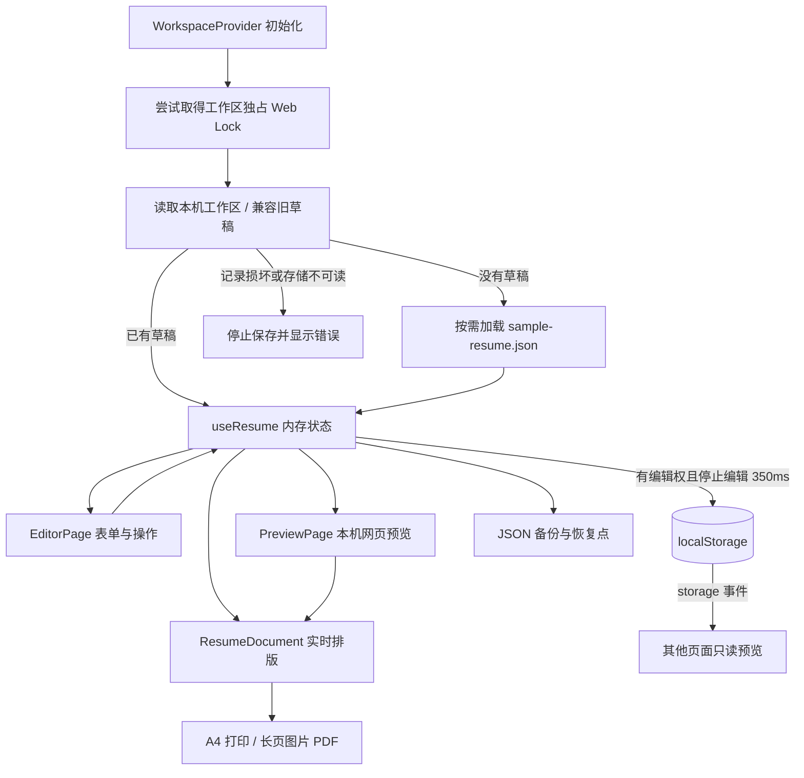

# 一纸简历：技术架构

[文档首页](../README.md) · [使用与开发](guide.md) · [面试准备](project-experience.md)

更新：2026-10-03。本文描述当前浏览器本机版。账号、云端同步、公开分享和 D1 读写已移除，旧实现保存在 Git 历史中。

## 1. 数据流



`WorkspaceProvider` 位于路由外，只创建一个 `useResume` 实例。切换编辑页和预览页仍使用同一份内存状态、撤销历史和保存状态。锁随整个工作区会话保留，切换路由不释放。隐藏页面时尽力保存；离页先保存再释放锁，从页面缓存恢复时重新申请。

`/` 与 `/editor` 在取得编辑权后显示编辑器，否则直接显示只读预览；`/resume` 是当前稿预览。后者不接受简历身份参数，不提供他人可访问的个人分享链接。

## 2. 模块职责

| 位置 | 负责什么 |
| --- | --- |
| `src/app/App.tsx` | 主题、工作区与路由组合，按路由加载编辑与预览页面。 |
| `components/WorkspaceProvider.tsx` | 取得工作区锁后初始化、加载失败重试、向页面提供同一份草稿状态。 |
| `pages/EditorPage.tsx` | 顶栏、栏目导航、编辑 / 预览模式、快捷键与面板入口。 |
| `components/editor/EditorForms.tsx` | 栏目到表单的映射。 |
| `components/editor/forms/` | 各栏目独立表单；`shared.ts` 放表单类型与不可变更新助手。 |
| `components/editor/EditorDialog.tsx` | 导入确认、恢复点、简历管理、重置面板。 |
| `pages/PreviewPage.tsx` | 当前稿阅读、只读同步提示、申请编辑、缩放与导出。 |
| `components/ExportDialog.tsx` | 固定导出副本、临时格式选择、独立排版节点。 |
| `components/editor/SortableList.tsx` | 指针捕获、8px 阈值、临时顺序、逐帧滚动、Motion 弹簧归位及键盘排序。 |
| `lib/workspaceLease.ts` | 非抢占工作区独占锁、申请取消、保存后释放。 |
| `lib/theme.ts` / `components/ThemeProvider.tsx` / `components/ThemeMenu.tsx` | 分离首屏主题初始化、状态与菜单，菜单随页面加载。 |
| `hooks/useResume.ts` | 草稿修改、会话历史、350ms 自动保存、重要替换前备份。 |
| `lib/initializeWorkspace.ts` | 优先读取本机数据；空工作区才请求示例；损坏记录停止写入。 |
| `lib/draftStore.ts` | 工作区校验与持久化、恢复点容量控制、删除条目恢复。 |
| `lib/storage.ts` | 旧本机键迁移及侧栏偏好读写。 |
| `lib/resumeFiles.ts` | JSON 文件读写与文件名处理。 |
| `lib/sampleResume.ts` | 示例请求、超时、并发复用、失败后重试。 |
| `components/resume/ResumeDocument.tsx` | 简历渲染与预览、打印共用的 DOM。 |
| `hooks/useResumeFit.ts` / `lib/resumePagination.ts` / `shared/paginate.ts` | 浏览器流布局测量、预览页边距与纯数字分页计算。 |
| `lib/exportResume.ts` | 隔离文档打印、截图与图片 PDF 生成。 |
| `src/shared/schema.ts` | Resume 类型、默认值、导入校验、旧数据规范化。 |
| `src/worker/index.ts` | 健康检查与已停用 API 的 410 响应。 |

路径未带前缀时均相对于 `src/app/`。UI 基础组件只保留项目实际使用的部分。

## 3. 数据模型与持久化

`Resume` 包含基本信息、教育、工作、项目、技能、获奖、论文、语言、自定义栏目，以及 `meta` 中的版式、排序和隐藏设置。隐藏影响渲染，不删除原始数据，JSON 仍包含隐藏字段。

工作区保存为一个 `yizhi:workspace:v2` 记录：

```text
Workspace { version: 2, activeId, drafts[] }
Draft { id, name, updatedAt, data: Resume, backups[] }
RecoveryPoint { id, label, time, data: Resume }
```

一次 `localStorage.setItem` 写入整个工作区，避免当前指针、内容与恢复点分开更新。读取时验证版本、有效草稿、唯一 ID、当前指针和恢复点；失败时不写入空白稿或示例覆盖原记录。

初始化同时保存原始记录快照（首次使用为 `null`），所有应用写入都由同一个 `persist` 入口比较当前存储与该快照。成功写入后才推进快照，配额失败不推进。示例下载前就捕获快照，避免下载期间其他页面新建的草稿被替换。相同内容不重复写入。

工作区通过 `navigator.locks.request("yizhi:workspace:writer", { mode: "exclusive", ifAvailable: true })` 取得独占编辑权。其他页面不排队、不抢占，直接预览已保存内容；“在此编辑”重新申请，成功后重新读取草稿才开放修改。所有模型写入口同时检查实际锁、读取就绪状态与冲突状态。浏览器不支持或拒绝锁请求时，仅提供预览和下载，不使用本机时间戳模拟互斥。

监听同源 `storage` 事件，包括清除全部数据；只读页刷新预览，编辑页发现外部记录变化则暂停本页后续写入。即使事件尚未送达，保存前的比较仍能发现已落盘的新版本。冲突时保留内存内容、显示备份入口；刷新前先导出 JSON，再按需导入为独立草稿。所有写入口均受保护，包括恢复点删除及页面关闭时保存。

遵守同一 Web Lock 的新版本页面之间只有一个写入者。保留快照比较防御不遵守锁的旧页面或其他来源；比较与写入仍不是针对这些来源的原子事务，不提供跨版本强互斥或自动合并。

仍支持 `yizhi:draft` 和 `resume-studio:draft` 旧数据。旧键作为迁移来源保留，读取过程不复制或写入键，取得编辑权后才保存 v2 工作区。建立新工作区失败会显示保存错误，不清理历史数据腾空间。

保存失败时内存中的修改仍在，可下载 JSON。刷新、浏览器崩溃或系统强制终止可能丢失未成功落盘的修改，因此不能把“已显示在预览里”当成“已保存”。

## 4. 撤销、恢复与多份草稿

- 每份草稿有独立会话历史，最多保留 50 个过去状态；同一输入框中 700ms 内的连续输入合并。
- 输入框内使用浏览器原生文字撤销；工具栏和输入框外的快捷键操作整份简历。
- 删除通知中的“撤销”只恢复被删条目，不丢弃后来输入的文字或新增条目。
- 导入替换、重置示例、恢复旧稿前，先成功写入恢复点再替换当前数据。
- 每份草稿最多 5 个恢复点；所有恢复点的 JSON 按 UTF-16 字符估算限制为 2 MiB，浏览器自身配额可能先达到。
- 新建和切换先保存当前稿，失败则留在原稿。
- 重置异步等待示例时会记录草稿身份和内容引用。如果期间换稿、发生新编辑或编辑会话变更，本次重置取消。

联系信息和栏目排序在拖动期间不修改 Resume；松手仅提交一次，一次撤销恢复原顺序。Escape、指针取消、失去捕获、换稿或失去编辑权均取消。Motion 按需引入数值动画函数，以 stiffness 600、damping 50、mass 1 的物理弹簧接续释放速度；落点决定顺序，不做惯性甩动。减少动态效果时保留直接跟手，取消归位位移。

普通撤销历史不跨刷新；持久恢复点只覆盖重要替换。工作区不做跨标签页合并。

## 5. 初始加载与包体积

示例的唯一来源仍是 [public/sample-resume.json](../public/sample-resume.json)，包含照片数据，保持可单独导入的 JSON 格式。应用不再把这份大 JSON 编译进 JavaScript。

已有工作区直接从浏览器读取，不请求示例。首次使用及重置时，`loadSampleResume` 从同源静态资源请求 JSON，10 秒超时，检查 HTTP 状态与数据格式。并发请求共用一个 Promise；成功后在当前会话复用，失败后允许重新请求。每个调用方得到独立副本。

编辑页面和独立预览均通过 React `lazy` 拆分；主题初始化、状态与菜单分离，菜单和页面组件不进入公共入口。共享排版和导出面板由页面依赖。截图和 jsPDF 继续在导出时动态导入。拆分遵循 [React lazy](https://react.dev/reference/react/lazy) 和 [Vite 异步加载](https://vite.dev/guide/features.html) 的机制。

`ResumeDocument` 按数据引用跳过无关渲染；测量依赖不可变 Resume 对象，无需每次渲染序列化含照片的整份数据。字体、图片和尺寸变化仍触发测量。

`pnpm check` 最后通过构建清单累计编辑器及其共享依赖的全部脚本：上限 600 kB，gzip 上限 200 kB，单个脚本上限 500 kB，公共入口及其静态依赖上限 450 kB。Motion 静态依赖同样纳入编辑器累计预算。不会只看变小的入口文件而漏掉拆出去的公共依赖。示例 JSON 单独报告；首次使用仍要下载它，不能把脚本减少量等同于首次总流量减少量。

## 6. 分页与导出

`useResumeFit` 通过 `resumePagination` 测量相邻内容的实际流布局距离，消除预览缩放的影响，避免重复累计折叠边距，再将数字交给 `paginateBlocks`。普通经历整体换页；超过单页容量的经历拆成条目头、要点与说明段，栏目标题、条目头与第一条要点连续保持在同页。单个段落仍超过一页时交给浏览器自然分页，并提示检查最终打印。

预览占位包含页尾剩余空间与下一页的上下页边距，白纸最小高度为完整页数乘以 A4 高度。打印隐藏这些占位，在下一段实际内容上应用 `break-before: page`，避免空占位在页界产生额外分页。切回长页时清除所有占位和分页标记。分页规则遵循 [CSS Fragmentation](https://www.w3.org/TR/css-break-3/)，最终结果仍受浏览器字体与打印设置影响。

导出窗口固定打开时的简历副本，格式仅改变临时副本，既不写草稿，也不触发自动保存或撤销。临时副本使用同一 `ResumeDocument` 排版；`exportResumePdf` 显式接收该节点，等待字体、照片与布局完成。两条路径如下：

| 路径 | 实现 | 边界 |
| --- | --- | --- |
| A4 PDF | 复制简历和样式到隐藏 iframe，等待样式、字体、照片后打开浏览器打印。 | 通常保留可复制文字；最终纸张、缩放、页眉页脚和文件名由浏览器控制。 |
| 长页 PDF | modern-screenshot 将简历截成 PNG，再由 jsPDF 写入宽 210mm 的单页 PDF。 | 文字为图片，不能选中；超过高度上限要求改用 A4。 |

导出失败移除临时节点并保留编辑状态。预览缩放不改变导出尺寸。分页计算测试不能代替系统打印结果的逐页检查。

## 7. 运行与部署

Vite 构建前端资源到 `dist/client`，Cloudflare 插件构建 Worker 到 `dist/yizhi`。Workers 静态资源托管处理 SPA 回退；只有 `/api/*` 先经过 Worker。

- `GET /api/health` 返回 `{ ok: true, service: "yizhi", storage: "browser" }`。
- 其余旧 `/api/*` 接口返回 410 和 `Cache-Control: no-store`。
- Worker 使用原生 Request / Response，无框架、身份服务或 D1 绑定。
- 仓库已移除数据库依赖、迁移脚本及绑定配置；本次清理不操作远端历史数据库。

启动、检查与部署命令统一见 [指南](guide.md#development)。

## 8. 验证与当前边界

自动化覆盖规范化、旧数据读取、工作区初始化、自动保存、Web Locks 互斥、只读入口、页面缓存恢复、跨版本冲突检测、拖动取消与一步撤销、独立导出副本、撤销恢复、容量失败、异步重置竞争、分页、PDF 尺寸、打印样式等待、主题、软键盘视区和旧接口停用。浏览器检查和不能替代的真机验收分别记录在 [体验与待办](ux-plan.md) 与 [本次验收](qa/2026-10-03-interaction.md)。

没有完整离线缓存：已有页面可本机编辑，A4 打印使用已加载资源；离线刷新、首次打开示例、首次使用尚未加载的图片 PDF 依赖不保证成功。新版本页面间已有独占编辑权，旧来源写入保留快照冲突检测，没有冲突合并、完整持久历史或多设备自动同步。

源码建议按 `schema` → `draftStore` → `initializeWorkspace` → `useResume` → `WorkspaceProvider` → `EditorPage` → 表单 / `ResumeDocument` → `exportResume` 阅读。
