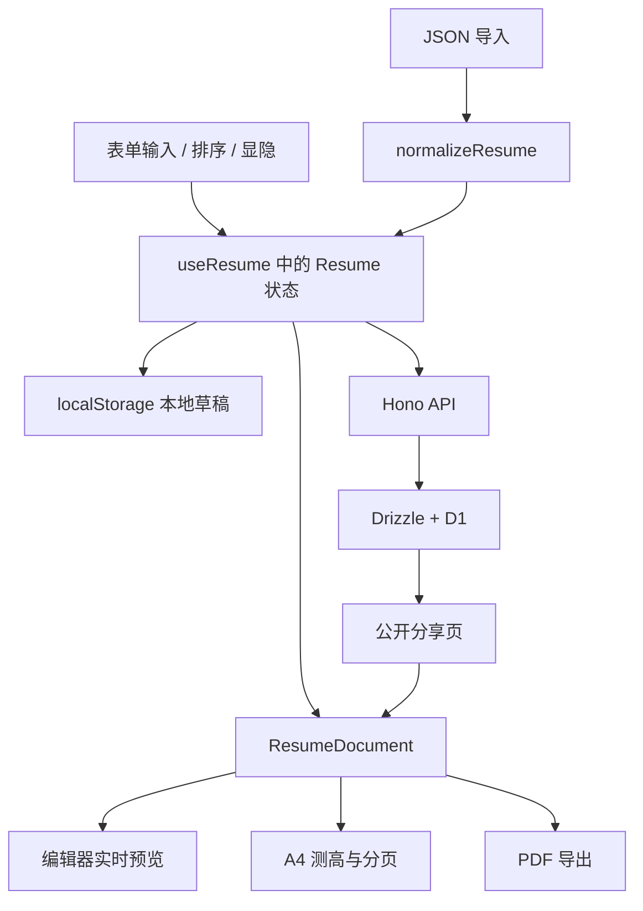

# 一纸简历：项目经历与实现详解

## 可直接用于简历的项目经历

**一纸简历（个人项目）｜独立开发｜2026.08—至今**

技术栈：React、TypeScript、Vite、Tailwind CSS、Hono、Drizzle ORM、Cloudflare Workers、D1

- 独立开发在线简历编辑器与公开分享页，支持栏目和联系信息拖拽排序、显隐、照片及版式配置、JSON 导入导出；编辑与分享共用简历排版组件，实现实时预览。
- 实现基于内容测高的 A4 分页，将标题与首条内容绑定以避免页尾孤立标题；提供保留文字的 A4 打印和适合分享的长图 PDF 导出。
- 使用 Hono API、Drizzle ORM 与 D1 持久化简历，结合本地自动保存和 `If-Match` 版本校验，在云端写入冲突时保留本地修改。

## 阅读说明与项目定位

下面逐项解释上面三条经历，依据本仓库 2026-09-13 的实现。标为“摘录”的代码保留对应实现；标为“简化示意”的代码省略界面样式、异常分支或类型细节，便于理解。

“独立开发”表示这是个人项目，开发范围覆盖表单交互、简历排版、导出、接口、存储和部署。它应放在项目经历中，不归入比亚迪或其他公司的在职工作成果。

日期沿用此前给出的草稿。此次导入的附件中，“一纸简历”的项目时间填写为 `2025`，与上面草稿不同；正式使用时应按真实开发时间统一。导入模板保留附件原值，本文没有替你更改日期。

### 技术栈分别承担什么工作

| 技术 | 在本项目中的具体用途 | 对应代码 |
| --- | --- | --- |
| React | 受控表单、简历状态、条件渲染、页面组件和副作用管理 | [EditorForms.tsx](../src/app/components/editor/EditorForms.tsx)、[useResume.ts](../src/app/hooks/useResume.ts) |
| TypeScript | 定义简历字段、栏目键、API 返回值、泛型排序组件 | [schema.ts](../src/shared/schema.ts)、[api.ts](../src/app/lib/api.ts) |
| Vite | 本地开发、前端构建，并通过 Cloudflare 插件构建 Worker | [vite.config.ts](../vite.config.ts) |
| Tailwind CSS | 编辑器控件、侧栏和按钮样式；简历纸张与打印规则使用专门的 CSS | [index.css](../src/app/index.css) |
| Hono | HTTP 路由、参数与 JSON 处理、状态码和响应 | [worker/index.ts](../src/worker/index.ts) |
| Drizzle ORM | 描述数据表并通过 D1 驱动执行查询、插入和更新 | [db/schema.ts](../src/db/schema.ts)、[worker/index.ts](../src/worker/index.ts) |
| Cloudflare Workers | 运行后端接口，结合静态资源配置提供前端应用 | [wrangler.toml](../wrangler.toml) |
| Cloudflare D1 | 持久化保存简历 JSON、分享标识和更新时间 | [db/schema.ts](../src/db/schema.ts) |

另外，React Router 负责页面路由，Lucide 提供图标，`modern-screenshot` 负责把 DOM 渲染为 PNG，`jsPDF` 把 PNG 写入长图 PDF。界面还使用了仓库中的 shadcn 风格组件和 Base UI。

简历数据目前通过 React state 与自定义 Hook 管理，没有使用 Zustand；接口中的数据规范化是手写函数，没有接入 Zod。SSO、Wujie 属于此前提供的比亚迪项目示例，不是本项目的能力。

### 从编辑到导出的整体路径



共享的是数据结构与渲染组件。公开页需要从接口读取已保存的数据，不会跟随另一个浏览器中的输入逐字同步。

## 第一条详解：编辑器、分享页与实时预览

> 独立开发在线简历编辑器与公开分享页，支持栏目和联系信息拖拽排序、显隐、照片及版式配置、JSON 导入导出；编辑与分享共用简历排版组件，实现实时预览。

### 1.1 在线简历编辑器如何组织

简历数据保存在一个 `Resume` 对象中。`basics` 保存姓名和联系方式；`experience`、`projects`、`education` 等数组保存履历；`meta` 保存显示顺序、显隐和版式偏好。

这样可以把“简历写了什么”和“简历怎么显示”分开。例如隐藏邮箱只改变 `meta.hiddenBasics`，不会删掉 `basics.email`。

表单是受控组件：输入框的值来自当前状态，输入事件通过更新函数生成新状态。以下摘录来自 [BasicsForm](../src/app/components/editor/EditorForms.tsx)：

```tsx
const update = (partial: Partial<Resume["basics"]>) =>
  setResume((current) => ({
    ...current,
    basics: { ...current.basics, ...partial },
  }));
```

外层和 `basics` 都生成新对象，未修改的字段继续保留。React 收到状态变更后重新渲染表单和预览，不需要手动寻找预览 DOM 并替换文字。

已有教育、工作、项目、技能、获奖、论文和语言表单，也支持自定义区块及其中的条目。普通履历条目的增删与上下移动由表单和 `ListControls` 配合完成。

### 1.2 “栏目和联系信息拖拽排序”具体指什么

这里的栏目是“教育经历、工作经验、项目经历”等整块内容；联系信息是邮箱、电话、地址、站点、生日和状态。

两者分别保存为：

```ts
meta.sectionOrder // 栏目键数组
meta.basicsOrder  // 联系字段键数组
```

两处界面共用泛型组件 [SortableList](../src/app/components/editor/SortableList.tsx)。例如联系信息使用以下调用方式，摘录已省略渲染内容：

```tsx
<SortableList
  items={meta.basicsOrder}
  getId={(key) => key}
  onReorder={(basicsOrder) => patchMeta(setResume, { basicsOrder })}
>
  {/* 渲染每个字段及拖动手柄 */}
</SortableList>
```

拖拽过程分为四步：

1. 手柄触发 `pointerdown`，记录正在拖动的条目 ID。
2. `pointermove` 时读取各行的 `getBoundingClientRect()`，计算指针到各行垂直中点的距离。
3. 选取距离最近的行作为目标位置，调用 `moveItem` 返回新数组。
4. `pointerup` 或 `pointercancel` 时结束拖动，清理事件监听。

关键位置判断摘录：

```ts
const rect = node.getBoundingClientRect();
const dist = Math.abs(event.clientY - (rect.top + rect.height / 2));
if (dist < closestDist) {
  closestDist = dist;
  closest = index;
}
```

数组重排函数摘录自 [ListControls.tsx](../src/app/components/editor/ListControls.tsx)：

```ts
export function moveItem<T>(list: T[], from: number, to: number): T[] {
  if (to < 0 || to >= list.length) return list;
  const next = [...list];
  const [item] = next.splice(from, 1);
  next.splice(to, 0, item);
  return next;
}
```

`itemsRef`、`getIdRef` 和 `onReorderRef` 让事件监听读取到最新的列表和回调，避免持续拖动时使用旧闭包中的数组。稳定 ID 同时用于 React key 和行 DOM 引用，不会因为交换下标而把条目认错。

当前不是任意元素自由拖放的画布，也没有实现跨栏目拖动条目；履历条目内部的移动按钮与整栏拖拽是两套不同入口。拖拽组件也没有完整的键盘排序和边缘自动滚动机制。

### 1.3 显隐为什么不会丢失内容

显隐状态保存在 `hiddenSections` 和 `hiddenBasics` 数组中。点击眼睛图标只切换键是否存在于数组里。

```ts
export function toggleHidden<T extends string>(list: readonly T[], key: T): T[] {
  return list.includes(key)
    ? list.filter((item) => item !== key)
    : [...list, key];
}
```

渲染阶段，隐藏栏目直接返回 `null`；联系字段必须同时满足“未隐藏”和“内容非空”。以下为 [ResumeDocument](../src/app/components/resume/ResumeDocument.tsx) 的摘录：

```ts
const hiddenBasics = new Set(resume.meta.hiddenBasics);
const visibleField = (key: BasicsFieldKey, value?: string) =>
  !hiddenBasics.has(key) && Boolean(value?.trim());

const contacts = resume.meta.basicsOrder.flatMap((key) => {
  const value = resume.basics[key];
  return visibleField(key, value) ? [{ key, value: value as string }] : [];
});
```

先按顺序数组遍历，再过滤隐藏或空字段，能保证编辑器配置的顺序就是预览中的顺序。重新显示时，原字段内容仍然存在。

显隐影响展示，不会从 JSON 或云端记录中删除原值；隐藏某字段不等于删除该数据或设置访问权限。

### 1.4 照片如何保存，为什么 JSON 能带着照片走

用户选择本地图片后，通过 `FileReader.readAsDataURL()` 读取，结果写入 `basics.photo`。

```ts
const reader = new FileReader();
reader.onload = () => update({ photo: String(reader.result) });
reader.readAsDataURL(file);
```

Data URL 同时包含媒体类型和编码后的图片内容，因此导出 JSON 时不需要另外拷贝照片文件；重新导入后，`` 可以继续显示。

是否显示由 `meta.showPhoto` 控制。图片数据存在而开关关闭时，照片仍保存在简历中，只是不参与排版。

这套实现没有单独的图片上传接口、R2 存储或压缩裁剪流程。代价是图片会增加 JSON、localStorage、API 请求和内置模板的体积；Base64 编码通常也比原始二进制占用更多空间。

### 1.5 版式配置包含哪些东西

| 配置 | 数据字段 | 作用 |
| --- | --- | --- |
| 左、中、右基本信息布局 | `meta.headerAlign` | 调整照片、姓名职位和联系方式的位置 |
| 照片显示 | `meta.showPhoto` | 是否把照片排入简历 |
| 字号基准 | `meta.fontScale` | 通过 CSS 变量调整文字大小；界面范围为 0.85—1.15 |
| 长图 / A4 | `meta.layoutMode` | 选择连续页面或分页模式，并决定导出方式 |
| 栏目顺序与显隐 | `meta.sectionOrder`、`meta.hiddenSections` | 调整大块内容的排列和显示 |
| 联系信息顺序与显隐 | `meta.basicsOrder`、`meta.hiddenBasics` | 调整基本信息中的字段排列和显示 |

左右布局使用 CSS Grid 镜像排列，照片、姓名职位、联系信息在纵向居中对齐；联系信息内部是两列网格。居中布局使用纵向 Flex，联系方式横向排列，空间不足时换行。

Lucide 图标通过字段键映射选择，图标宽高固定为相对于字号的单位，并禁止缩小。以下摘录来自 [index.css](../src/app/index.css)：

```css
.resume-contacts li {
  display: flex;
  align-items: flex-start;
  gap: 1.1mm;
  min-width: 0;
  line-height: 1.35;
}

.resume-contact-icon {
  width: 1.05em;
  height: 1.05em;
  flex: none;
  margin-top: 0.15em;
}
```

文字行高为 `1.35em`，图标高度为 `1.05em`，差值的一半为 `0.15em`。这个顶部间距让图标与文字首行在垂直方向居中；长邮箱换行时，图标仍对应第一行。

工作经验现在只渲染职位，不再拼接旧数据里的地点：

```tsx
<EntryHeader
  title={item.company}
  meta={item.position}
  date={dateRange(item.startDate, item.endDate)}
/>
```

因此旧 JSON 即使残留 `location`，也不会在职位后面自动出现“· 哈尔滨”或“· 中国”。教育经历的地点有自己的编辑入口和渲染规则。

### 1.6 JSON 导入导出做了哪些处理

导入顺序是：读取文件文本 → `JSON.parse` → `isResumeLike` 做基础结构检查 → `normalizeResume` 规范化 → 替换编辑状态。

`isResumeLike` 主要检查是否存在 `basics` 对象，并不是完整的 JSON Schema 验证。`normalizeResume` 负责字符串类型、数组、缺失 ID、默认配置和旧数据兼容；TypeScript 类型在编译后不存在，无法代替这些运行时检查。

导出使用 JSON Blob、临时对象 URL 和带 `download` 属性的链接触发下载，之后释放对象 URL。没有把简历内容提交给外部文档转换服务。

本次换模板时修复了一个容易被忽略的细节：用户主动留空的日期不能被历史示例日期补回。以下摘录来自 [schema.ts](../src/shared/schema.ts)：

```ts
startDate: typeof row.startDate === "string" ? row.startDate : sampled?.startDate,
endDate: typeof row.endDate === "string" ? row.endDate : sampled?.endDate,
```

`""` 也是字符串，因此会被保留。对于仍需兼容的历史示例，只有非字符串或缺失日期才走原有补值分支。这一点覆盖了附件中沿用旧项目 ID、但结束时间主动留空的情况。

### 1.7 为什么把模板统一放在 sample-resume.json

[public/sample-resume.json](../public/sample-resume.json) 保存用户提供的完整模板；[seed.ts](../src/shared/seed.ts) 在构建时读取它：

```ts
import sampleResumeJson from "../../public/sample-resume.json?raw";
import { DEFAULT_SLUG, normalizeResume } from "./schema";

export const SAMPLE_RESUME = normalizeResume(JSON.parse(sampleResumeJson));
```

`?raw` 由 Vite 把文件作为字符串导入，随后解析并规范化。编辑器“重置为示例”、默认公开页回退和首次 D1 写入都使用这个对象，避免 JSON 文件与另一份手写 TypeScript 示例长期不同步。

模板更新不会自动覆盖数据库里已经保存的简历，也不会主动删除浏览器的现有草稿。新模板与已有用户内容是不同的数据来源。

### 1.8 公开分享页和实时预览如何共用组件

路由定义在 [App.tsx](../src/app/App.tsx)：`/` 与 `/editor` 是编辑器，`/resume` 是默认公开页，`/r/:slug` 是指定简历的公开页。

编辑页与公开页都使用同一个组件，简化示意如下：

```tsx
<ResumeDocument resume={resume} onLayout={handleLayout} />
```

`ResumeDocument` 统一负责栏目、联系图标、基本信息布局、日期文本和分页标记。这样修改工作经验显示规则后，两个页面和基于该 DOM 的导出路径都会使用更新后的规则。

实时预览来自本地 React 状态更新，和网络保存速度无关。内容或版式变化会生成新的 `revision`，触发 `useResumeFit` 重新测量；纸张宽度变化和字体加载完成也会触发计算。

公开页优先读取 D1；默认简历在读取失败时可以回退到本机草稿或示例。其他不存在的 slug 显示未找到页面。它没有 WebSocket 推送，也不是多人实时协作编辑器。

## 第二条详解：内容测高、A4 分页与两种 PDF

> 实现基于内容测高的 A4 分页，将标题与首条内容绑定以避免页尾孤立标题；提供保留文字的 A4 打印和适合分享的长图 PDF 导出。

### 2.1 为什么需要内容测高

同样的字符数，在不同字体、字号、可用宽度和段落结构下会占用不同高度。简历又包含标题、条目、项目符号和照片，只按字符数或数组条数分页容易把条目切开。

本项目先让浏览器完成排版，再测量实际 DOM 块的高度。分页使用浏览器已经算好的布局结果。

### 2.2 A4 的尺寸与正文可用高度

A4 宽高为 210mm × 297mm。简历纸张宽度使用 `210mm`，上下边距为 `14.5mm`，左右边距为 `16mm`，正文宽度约为 178mm。

在 96 CSS 像素对应一英寸的换算下，A4 约为 793.7 × 1122.5 CSS px。实际代码按纸张元素的 `clientWidth` 和高宽比计算页高，再减去上下 padding：

```ts
const PAGE_RATIO = 297 / 210;
const pageHeight = () => Math.max(1, sheet.clientWidth * PAGE_RATIO);

const contentBox = () => {
  const style = getComputedStyle(sheet);
  const pad = parsePx(style.paddingTop) + parsePx(style.paddingBottom);
  return Math.max(120, pageHeight() - pad);
};
```

编辑器为适应屏幕而缩放预览，不代表改变了简历本身的纸张规格。测量主要使用 `offsetHeight`、`clientWidth` 等布局尺寸，避免直接把屏幕缩放后的视觉尺寸作为纸张尺寸。

### 2.3 如何把 DOM 转为分页输入

[ResumeDocument.tsx](../src/app/components/resume/ResumeDocument.tsx) 用 `data-block-id` 标记可测量内容，用 `data-block-kind` 区分普通条目与需要和下一个块保持在一起的标题。

标题对应 `keep`，普通工作条目、项目条目等对应 `unit`。分页函数接收的是简单数据：

```ts
interface PaginateBlock {
  id: string;
  height: number;
  kind: "unit" | "keep";
}
```

测量时把块本身的 `offsetHeight` 与上下外边距相加；如果是栏目中的第一个块，还计入栏目外边距。核心摘录：

```ts
const style = getComputedStyle(node);
let height = node.offsetHeight
  + parsePx(style.marginTop)
  + parsePx(style.marginBottom);
```

每次重新测量前，会删除上次插入的分页垫片，否则垫片高度可能被反复计入。DOM 测量和垫片管理放在 [useResumeFit.ts](../src/app/hooks/useResumeFit.ts)，分页决策放在不依赖 DOM 的 [paginate.ts](../src/shared/paginate.ts)，便于分别理解和测试。

### 2.4 标题与首条内容如何绑定

考虑一页正文可用高度为 100，当前已经用了 80，接下来标题高 12、第一条内容高 30。

只判断标题自身时，`80 + 12 = 92`，会把标题留在这一页；正文条目却必须去下一页。阅读者会在页尾看到一个孤立标题。

项目通过 `peekHeight` 提前看下一个块：

```ts
export function peekHeight(blocks: readonly PaginateBlock[], index: number): number {
  const block = blocks[index];
  if (!block) return 0;
  if (block.kind === "keep" && blocks[index + 1]) {
    return block.height + blocks[index + 1].height;
  }
  return block.height;
}
```

现在检查的是 `80 + 12 + 30 = 122`，超过 100，于是在标题之前换页，让标题和首条内容一起进入下一页。

它只把标题与紧接着的一个块一起考虑，不会要求整个工作经历栏目都放在一页。若标题加首条内容本身就超过整页可用高度，也无法靠这种规则保证两者完整容纳。

### 2.5 按原顺序逐块放入页面

分页采用顺序贪心策略：沿简历当前顺序遍历，能放下就继续；放不下就在前一个块之后记录分页点，并重置本页已用高度。

核心摘录：

```ts
const needed = peekHeight(blocks, i);
if (used > 0 && used + needed > pageHeight + EPS) {
  breaks.push({
    afterId: blocks[i - 1].id,
    height: Math.max(0, pageHeight - used),
  });
  pageCount += 1;
  used = 0;
}
used += block.height;
```

`EPS = 0.5` 用于容忍少量测量舍入误差。输出包括页数、分页点及末页已使用高度。

纯分页决策是 O(n) 遍历；DOM 测量、浏览器重排和多次尝试间距产生的成本需要另算。这个算法不会为了填满页面而重新排列用户的工作或项目经历。

当前以整条工作或项目作为一个块，没有进一步拆分超长条目内部的每条 bullet。超高内容仍需要浏览器打印引擎参与分页，不能宣称已经实现通用文档排版引擎。

### 2.6 预览中的分页垫片和打印分页有什么关系

分页结果中的 `afterId` 用来定位前一块内容，`height` 用来创建占据本页剩余空间的垫片：

```ts
const spacer = document.createElement("div");
spacer.className = SPACER_CLASS;
spacer.setAttribute("aria-hidden", "true");
spacer.style.height = `${Math.max(0, item.height)}px`;
el.after(spacer);
```

上面是 `applySpacers` 的局部摘录。垫片是展示辅助元素，不写入简历 JSON。

进入打印时，垫片高度清零并转为明确分页指令：

```css
.resume-page-spacer {
  height: 0 !important;
  margin: 0 !important;
  break-after: page;
  page-break-after: always;
}
```

同时对标题设置 `break-after: avoid`，对条目设置 `break-inside: avoid`。前者尽量避免紧接标题换页，后者尽量避免把单个条目拆开。

这里实现了内容块和分页意图的复用。预览垫片并不是浏览器原生的分页盒；外边距折叠、每页打印边距、字体和超高条目仍可能造成预览与最终 PDF 的差异，不能承诺所有内容都像素级一致。

### 2.7 空白与重算如何处理

当末页使用高度低于可用高度的 88% 时，代码会在间距倍率 1—1.22 之间执行 9 次二分尝试，前提是不增加页数。如果最终页数超出原值，会恢复原间距。

这一步主要调整段落和栏目间距；当前流程没有通过缩小文字强行塞进一页，`--resume-type-fit` 在这条路径中保持为 1。

重新计算的触发包括简历内容或版式变化、纸张宽度变化以及 `document.fonts.ready`。导出函数另外等待图片加载；分页 Hook 本身没有为每张照片单独安装加载监听，因此图片异步加载后的分页仍有进一步完善空间。

### 2.8 保留文字的 A4 打印如何实现

A4 模式走 [exportPrintablePdf](../src/app/lib/exportResume.ts)，流程如下：

1. 找到 `.resume-print-root`，等待字体和图片。
2. 创建不可见的 iframe，写入一个独立 HTML 文档。
3. 复制当前页面样式，把简历 DOM 克隆进去。
4. 清除编辑器预览缩放、阴影和多余外层尺寸。
5. 设置 A4、页边距和分页 CSS，再调用 iframe 的 `print()`。
6. 打印结束后移除 iframe，并设置超时清理兜底。

关键调用摘录：

```ts
const clone = source.cloneNode(true) as HTMLElement;
clone.style.transform = "none";
clone.style.boxShadow = "none";
frameDocument.body.appendChild(clone);

await frameDocument.fonts?.ready;
await waitForImages(clone);
frameWindow.focus();
frameWindow.print();
```

采用独立 iframe 是为了只打印简历，不把编辑侧栏和工具栏一起打印。文字仍以文本 DOM 的形式交给浏览器打印引擎，通常能在保存的 PDF 中选择和复制。

这里的“A4 导出”实际打开浏览器打印对话框，由用户选择另存为 PDF；不是后端直接生成并下载 PDF，也不是调用 jsPDF 逐字绘制。它没有保证所有 ATS 系统都能正确解析内容。

### 2.9 长图 PDF 如何实现

长图模式走 `exportShareImagePdf`：先复制简历到屏幕外的容器，去除缩放，以 2 倍比例调用 `domToPng`，再把整张图片放入自定义高度的 PDF。

根据 PNG 高宽比计算 PDF 高度的代码摘录：

```ts
const heightMm = Math.max(80, (img.height / img.width) * A4_WIDTH_MM);
const pdf = new jsPDF({
  orientation: "portrait",
  unit: "mm",
  format: [A4_WIDTH_MM, heightMm],
  compress: true,
});
pdf.addImage(dataUrl, "PNG", 0, 0, A4_WIDTH_MM, heightMm, undefined, "FAST");
pdf.save(filename);
```

宽度沿用 210mm，高度随内容增长，最小为 80mm。界面虽然叫“长图”，下载物仍然是 PDF，只是 PDF 内嵌了一张整页图片。

| 对比项 | A4 打印 | 长图 PDF |
| --- | --- | --- |
| 生成路径 | 克隆文字 DOM → 浏览器打印 | DOM → PNG → jsPDF |
| 页面尺寸 | A4，可多页 | 固定宽度、自定义高度 |
| 文字 | 通常保留文本对象 | 文字成为图片像素，没有独立文本层 |
| 使用场景 | 打印、投递 | 整体浏览、视觉分享 |
| 主要限制 | 受浏览器打印设置和分页规则影响 | 文件与内存占用随图片尺寸增长，超长页面存在尺寸限制 |

两种方式复用同一份简历内容，但服务于不同的输出需求。

## 第三条详解：API、数据库、本地保存与版本冲突

> 使用 Hono API、Drizzle ORM 与 D1 持久化简历，结合本地自动保存和 `If-Match` 版本校验，在云端写入冲突时保留本地修改。

### 3.1 Hono、Drizzle、D1 各自负责什么

Hono 接收 HTTP 请求并返回响应；Drizzle 负责构造和执行数据库查询；D1 保存最终数据。TypeScript 中的接口类型与数据库持久化是两个不同层次。

数据表摘录自 [db/schema.ts](../src/db/schema.ts)：

```ts
export const resumes = sqliteTable("resumes", {
  id: text("id").primaryKey(),
  slug: text("slug").notNull().unique(),
  data: text("data").notNull(),
  updatedAt: text("updated_at").notNull(),
});
```

`id` 是内部标识；`slug` 是公开链接中的可读标识，具有唯一约束；`data` 保存序列化后的完整简历；`updated_at` 保存更新时间，也被用于版本比较。

整份 JSON 存为一个字段，适合当前“整份读取、整份保存”的使用方式，也便于增加自定义栏目。它不是把公司、项目和技能拆成多张关系表的设计，不适合直接据此声称支持复杂的跨简历统计查询。

### 3.2 API 如何读取和保存简历

| 请求 | 行为 |
| --- | --- |
| `GET /api/health` | 返回服务状态及数据库是否可用 |
| `GET /api/resumes` | 返回简历 ID、slug 和更新时间列表 |
| `GET /api/resumes/:idOrSlug` | 按 ID 或 slug 读取一份简历 |
| `PUT /api/resumes/:idOrSlug` | 规范化输入后创建或更新一份简历 |

保存接口会解析 JSON，调用 `normalizeResume`，查找已有记录，然后检查版本并决定更新或插入。更新保存 `JSON.stringify(data)` 和新的 ISO 时间戳。

读取时也会解析并规范化存储的 JSON。D1 不可用时，默认简历可回退到内置模板；已有表为空且请求默认简历时，会首次写入模板。

`openDb` 使用 `env.DB` 获取绑定，并执行幂等建表与唯一索引语句。仓库也提供了对应的 [迁移 SQL](../drizzle/0000_resumes.sql)。

### 3.3 Cloudflare 部署结构

[wrangler.toml](../wrangler.toml) 中的 `assets.directory` 指向前端构建目录，`run_worker_first = ["/api/*"]` 让 API 请求先经过 Worker，其他路径使用静态资源与 SPA 回退。

这意味着 `/r/某个标识` 先由前端路由展示公开页，再请求 JSON API。当前不是服务端渲染简历 HTML。

数据库绑定名为 `DB`，Worker 通过 `c.env.DB` 使用 D1。`nodejs_compat` 是运行兼容配置，不代表部署了一台常驻 Node.js 服务器。

常用命令是 `pnpm check` 执行类型检查、测试和构建，`pnpm deploy` 执行构建并通过 Wrangler 部署。修改模板会随新版本发布，但不等同于更新已有 D1 记录。

### 3.4 本地自动保存的作用与时机

本地草稿使用 `localStorage`，键为 `resume-studio:draft`。以下摘录来自 [useResume.ts](../src/app/hooks/useResume.ts)：

```ts
useEffect(() => {
  if (!hydrated) return;
  const timer = window.setTimeout(() => saveLocalResume(resume), 350);
  return () => window.clearTimeout(timer);
}, [resume, hydrated]);
```

连续输入会取消旧定时器，并在最后一次变化后等待约 350ms 再保存，减少同步写 localStorage 的频率。刷新后优先恢复本地草稿，无法读取或解析时回退到内置模板。

`hydrated` 表示初始化读取流程完成，用来避免初始化尚未结束就开始保存。初始化时，已有本地草稿会被保留；没有本地草稿时，才使用读取到的云端内容替换当前状态。

这是“本地草稿恢复”能力，不是完整的离线应用：没有 Service Worker 页面缓存、持久化重试队列或操作日志。清除站点数据、localStorage 配额不足或保存计时结束前关闭页面，仍可能影响草稿保留。

### 3.5 云端自动保存如何调度

数据库可用且初始化完成后，另一个 effect 在约 1600ms 后调用 `persistCloud`；依赖变化时清理原定时器。遇到已知冲突则暂停自动保存。

```ts
useEffect(() => {
  if (!hydrated || !dbAvailable || cloudConflict) return;
  const timer = window.setTimeout(() => {
    void persistCloud();
  }, 1600);
  return () => window.clearTimeout(timer);
}, [resume, hydrated, dbAvailable, cloudConflict, persistCloud]);
```

`resumeRef.current` 在每次渲染更新，使异步保存读取最新简历对象。`saving` 主要用于显示保存状态和禁用手动按钮，不是完整的互斥锁或请求队列。

当前调度还存在优化空间：`persistCloud` 依赖 `cloudUpdatedAt`，保存成功更新版本后会改变回调引用，而自动保存 effect 依赖这个引用，因此可能在没有再次编辑时重新调度保存。不能把当前实现描述为“保证一次修改只请求一次”。

### 3.6 If-Match 版本校验解决什么问题

例如两个页面都读取到版本 `v1`。页面 A 保存后，数据库变成 `v2`；页面 B 仍基于 `v1` 编辑，如果直接覆盖，会把 A 的修改抹掉。

客户端保存时把自己所依据的更新时间同时放入请求头 `If-Match` 和 JSON 中的 `baseUpdatedAt`。服务端优先读取请求体中的字符串，否则读取请求头。

客户端摘录自 [api.ts](../src/app/lib/api.ts)：

```ts
const headers: Record<string, string> = { "Content-Type": "application/json" };
const baseUpdatedAt = options?.force ? undefined : options?.baseUpdatedAt || undefined;
if (baseUpdatedAt) headers["If-Match"] = baseUpdatedAt;
```

版本比较摘录自 [sync.ts](../src/shared/sync.ts)：

```ts
export function isStaleWrite(
  existingUpdatedAt: string | null | undefined,
  baseUpdatedAt: string | null | undefined,
): boolean {
  if (!existingUpdatedAt || !baseUpdatedAt) return false;
  const existing = existingUpdatedAt.trim();
  const base = baseUpdatedAt.trim().replace(/\"/g, "");
  if (!existing || !base || base === "*") return false;
  return existing !== base;
}

```

服务端检测不一致后，在数据库更新语句之前返回 `409 Conflict`，响应中带上当前云端简历与更新时间。客户端将结果区分为 `saved`、`conflict` 和 `error`，无需靠提示文字猜测结果。

这里借用了 `If-Match` 的版本前置条件含义，但使用的是应用自定义时间戳协议：没有完整的 ETag 生成与多值条件解析，冲突也按当前接口约定返回 409。

### 3.7 “冲突时保留本地修改”究竟怎么做到

检测到冲突后，`useResume` 设置 `cloudConflict = true`，显示提示，并返回 `conflict`。这个分支没有用远端响应覆盖当前 `resume`。

```ts
if (saved.status === "conflict") {
  setCloudConflict(true);
  if (!conflictNotified.current) {
    conflictNotified.current = true;
    toast.message("云端有更新，已保留本地稿。可在菜单里覆盖保存。");
  }
  return "conflict";
}
```

本地自动保存的 effect 不依赖数据库可用性和冲突状态，所以当前编辑内容仍会保存到本机；云端自动保存则因 `cloudConflict` 暂停，避免重复冲突提示。

菜单会提供“覆盖保存到云端”。它传入 `force: true`，本次请求不带旧版本条件，表达用户主动以本地稿覆盖远端的选择。保存成功后刷新版本并清除冲突状态。

目前没有字段级比较、自动合并、版本历史或冲突可视化界面；“保留本地修改”指保住当前编辑对象及本地草稿，不代表已经合并双方改动。

### 3.8 版本保护的实际边界

这里最适合准确表述为“检测已过期版本并保留本地稿”。有几个重要边界：

- 数据库操作是先查询版本、再按 ID 更新，校验与写入不是一个原子条件更新。两个请求同时读到同一版本时，仍可能都通过检查。
- 旧客户端不传版本时，当前接口允许写入；强制覆盖也有意跳过版本检查。
- 本地草稿没有保存它最初对应的云端版本。初始化时保留旧本地内容、同时读取最新远端时间戳，并不能证明本地内容已经与远端合并。
- 当前 Worker 没有实现身份认证和简历所有者授权。公开页只有阅读界面，不代表写入 API 已具备权限隔离。

如果后续要完善，可以把版本条件直接加入数据库 `UPDATE ... WHERE id = ? AND updated_at = ?` 并检查受影响行数，保存本地草稿的基准版本，再增加写入授权。以上是后续方向，不应写成当前已经完成的成果。

## 验证与面试表达

### 现有测试能证明什么

本次 `pnpm check` 通过类型检查、57 项 Vitest 测试和生产构建。测试主要覆盖数据规范化、存储、API 客户端、保存 Hook、分页纯函数和版本比较。

| 测试位置 | 覆盖内容 |
| --- | --- |
| [schema.test.ts](../src/test/schema.test.ts) | 模板内容保留、空日期保留、字段规范化、显隐与顺序 |
| [paginate.test.ts](../src/test/paginate.test.ts) | 单页、分页位置、标题与首条内容、超高块 |
| [sync.test.ts](../src/test/sync.test.ts) | 时间戳一致与不一致、无版本和强制覆盖条件 |
| [api.test.ts](../src/test/api.test.ts) | 请求参数、版本头、响应分类 |
| [use-resume.test.ts](../src/test/use-resume.test.ts) | 本地恢复、保存流程、冲突状态 |
| [storage.test.ts](../src/test/storage.test.ts) | 本地读写与回退 |
| [worker.test.ts](../src/test/worker.test.ts) | 无 D1 时的 API 行为 |
| [export-resume.test.ts](../src/test/export-resume.test.ts) | 缺失预览根节点时的错误处理 |

分页纯函数测试不能替代浏览器打印视觉检查；现有 Worker 测试也不是连接真实 D1 的并发写入测试。测试数量不等于已经验证所有字体、纸张设置和网络场景。

### 可以直接复述的介绍

> 这是我独立开发的在线简历工具。我把简历内容和显示配置保存在统一的数据结构里，用 React 表单编辑，编辑页和公开页共用一个简历组件。主要花精力的部分是简历排版和导出：先测量浏览器中的内容块高度，按顺序分页，并把栏目标题与第一条内容一起判断，减少页尾孤立标题。导出分成两条路径，投递用浏览器打印保留文字，分享用 DOM 转图片后生成长图 PDF。存储方面同时保留本地草稿和 D1 云端记录，用版本时间戳识别过期写入，冲突时先保留本地编辑内容。

### 被追问时应抓住的要点

| 追问 | 回答重点 |
| --- | --- |
| 为什么复用排版组件？ | 编辑、公开展示和导出使用相同 DOM 结构，减少规则重复和显示差异。 |
| 为什么不用字符数分页？ | 字体、字号、宽度与换行都会影响高度，浏览器实际布局更能反映当前内容。 |
| 分页最关键的规则是什么？ | 按原顺序放入页面，标题使用自身高度加首条内容高度提前判断。 |
| 为什么有两种 PDF？ | 打印需要文本和标准纸张，视觉分享需要连续页面；两种输出的性质不同。 |
| 数据为什么存 JSON？ | 当前读写以整份简历为单位，内容结构多变；暂时没有跨字段复杂查询需求。 |
| 冲突后怎么处理？ | 暂停自动云端保存，保留当前状态和本地草稿，由用户决定是否覆盖。 |
| 是否已经保证并发安全？ | 只做了过期版本检测；原子更新、完整授权和冲突合并还没有实现。 |
| 独立开发的价值如何说明？ | 讲清楚自己完成的前后端范围、技术取舍和验证方式，不编造用户量或效率百分比。 |
