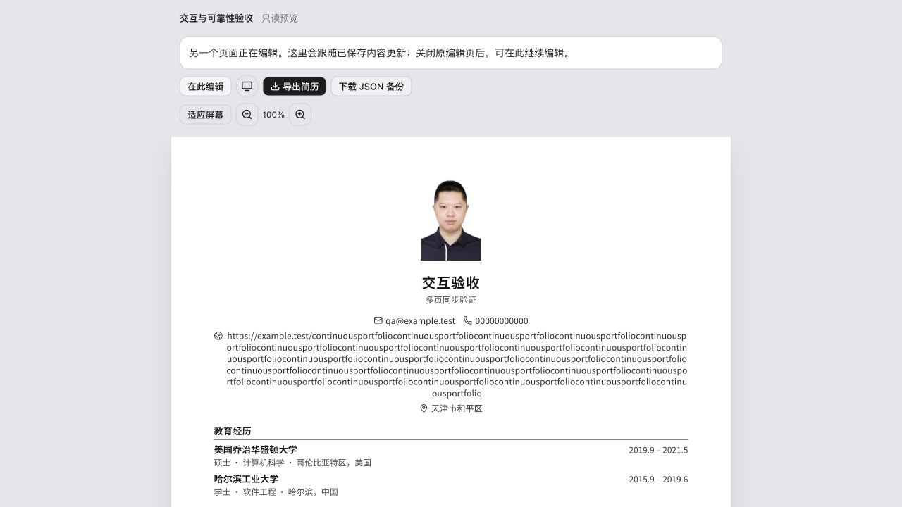
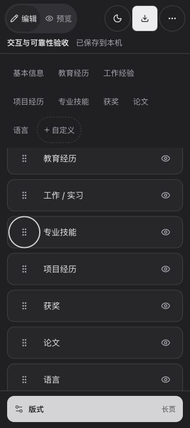

# 2026-10-03 交互与可靠性收尾验收

[文档首页](../../README.md) · [验收索引](README.md) · [后续验收计划](../ux-plan.md)

基线仍为 `63d12b6`，在上一轮全部未提交改动上增量实施。保留 v2 工作区、旧草稿兼容与 JSON 格式；未迁移数据库，未发布生产。

后续复查发现并修复了删除后的键盘焦点与 A4 预览页界问题：复杂样例现在预览为 4 页，最新检查为 125 项测试。本文保留当时的 5 页读数与历史产物，详见 [分页与焦点复查](2026-10-03-pagination-focus.md)。

## 实施范围

1. 主题初始化、状态与菜单分离；编辑页和预览页按路由加载，公共入口不包含页面及菜单组件。
2. 非抢占 Web Lock 保护整个工作区；取得编辑权后读取最新数据才开放所有修改入口；只读页同步已保存内容，可申请接手与下载；离页先保存后释放，页面缓存恢复重新检查。
3. 两处拖动排序仅维护临时顺序，8px 后开始、捕获指针、保持抓取偏移；松手提交一次。Escape、指针取消、失去捕获、禁用或换稿取消。静止在边缘仍逐帧滚动，归位使用 Motion 数值动画与物理弹簧，继承释放速度。
4. 当前稿名称和保存状态可见；手机保留编辑 / 预览、主题、导出、更多，至少 44×44px；工具栏可换行；具名操作按钮、隐藏行保持可读；减少动态效果、减少透明度、增强对比度适配。
5. 编辑页与只读页共用独立导出窗口；打开时固定简历副本，格式仅作用于副本，向导出函数显式传入临时排版节点。

## 自动化与构建

最终 `pnpm check`：**12 个文件、111 项测试**，类型检查、生产构建与全部体积预算通过。

新增 / 扩展覆盖：

- 同时申请只有一个编辑者；释放前保存；待处理申请取消；StrictMode 不泄漏锁。
- 只读状态下所有模型写入口及回调不执行；同步已保存内容；接手前重新读取；读取完成前不能修改。
- 页面缓存恢复遇到新编辑者不写入；配额失败保留未保存稿，包括首次记录尚为 `null` 的情况；旧版本写入触发冲突；损坏数据不覆盖。
- 浏览器不支持或拒绝 Web Locks 时保持只读，读取旧键也不产生迁移写入。
- 14 项排序检查：误触阈值、鼠标 / 触控指针、取消、换稿、禁用、连续边缘滚动、快速反向、归位中再次抓取、物理弹簧速度参数、减少动态效果、键盘边界、一步撤销。
- 导出格式不会修改简历或写工作区；只读同步期间已打开的导出副本保持稳定；原有短页 / 长页 PDF 几何和打印样式等待测试继续通过。

| 产物 | 本轮 | 预算 |
| --- | --- | --- |
| 公共入口及静态依赖 | 313.60 kB | ≤450 kB |
| 编辑器累计脚本（含共享依赖与 Motion） | 592.59 kB | ≤600 kB |
| 编辑器累计 gzip | 191.75 kB | ≤200 kB |
| 最大单脚本（按需加载的 jsPDF） | 399.06 kB | ≤500 kB |
| CSS | 52.35 kB / gzip 10.67 kB | 单独报告 |

上一轮入口约 496.65 kB。预算没有上调；示例 JSON 仍为单独按需下载的 371.40 kB，不包含在 JavaScript 统计中。

## 实际浏览器检查

使用生产构建和独立本地端口 `127.0.0.1:45223`，与上一轮端口及生产数据隔离。浏览器样例仅修改该端口的本机工作区。

- 页面一可编辑，页面二直接只读，无表单和修改入口。页面一修改姓名、职位并保存后，页面二自动更新预览。
- 页面二点击“在此编辑”不会抢占。页面一切换到 `/resume` 仍保留编辑权；关闭页面一后，页面二点击即可接手，读取最新姓名与职位。
- 联系信息通过真实鼠标路径从第一项拖到第三项，松手后顺序变化；一次“撤销修改”恢复原顺序。方向键排序同样有效。
- 栏目顺序通过键盘把“专业技能”从第 4 项移到第 3 项，并可一次撤销。深色主题下内容及操作保持可见。
- 320px × 720px 下，页面宽度与滚动宽度均为 320px；顶栏保持单行，编辑 / 预览按钮各 57×44px，主题 / 导出 / 更多各 44×44px；顶栏行高 62px。独立网页预览在更多菜单中。
- 导出完成后焦点回到“导出简历”；菜单与弹窗使用既有 Base UI 结构。当前检查为局部键盘路径，不代表完整读屏验收。
- 页面浏览器日志未见错误或警告。

手机顶栏及表单：

只读预览与接手、下载入口：

深色栏目排序：

## 复杂导出样例与结果

通过正常表单建立样例，保留原示例的其余栏目：

- 名称“交互验收”、职位“多页同步验证”，邮箱 `qa@example.test`、电话全零。
- 显示照片，站点使用 `https://example.test/` 加 28 次 `continuousportfolio`，共 553 个字符。
- 第一条工作经历填入 48 条编号中文要点：`验收要点 01` 至 `48`，每条都说明中文业务、连续网址、照片、超长经历跨页和输入保存恢复验证。
- 工作区名称“交互与可靠性验收”，保存的版式为 `single`。

只读页选择 A4 时，页面中原稿仍为 `single`、1 张长页；临时副本为 `multi`、测量为 5 页，包含 3 个显式分页占位和 1 个超高条目。临时副本宽度 793.70 CSS px。已触发系统打印，但原生窗口无法通过当前 Computer Use 工具操作（禁止访问 Codex 窗口），随后关闭该只读测试页以退出阻塞。因此 **没有取得最终 A4 PDF，不能确认真实页数、页尾标题、无空白页和裁切结果**。

重新从只读页导出长页，文件实际落盘：

- `~/Downloads/yizhi-complex-long-page.pdf`：**2,474,067 字节，1 页，595.276 × 2635.42 pt，约 210 × 929.72 mm**。
- 使用 Poppler 读取并渲染检查：照片可见，长网址在纸内换行，编号 01–48、后续项目和末尾语言栏目完整，无横向裁切或空白尾页。该格式是图片 PDF，不提供文字复制或可访问标签。
- 同时下载 `~/Downloads/交互验收-多页同步验证-简历.json`，解析确认仍为 `single`，显示照片、48 条要点和完整 553 字符网址。导出没有改写草稿格式。
- 已完成导出函数的显式节点路径；A4 最终输出与实体打印不以图片 PDF 结果替代。

## 未完成的验收关卡

- **复杂 A4 最终 PDF 与实体打印**：系统打印工具限制如上，需在可操作的浏览器打印窗口保存文件并逐页检查，再进行实体打印。
- **真实 200% 浏览器缩放**：尝试页面缩放快捷键后，当前内嵌浏览器的 CSS 视口和设备像素比均未改变；没有把 320px 视口模拟计为缩放通过。
- **三类系统辅助显示偏好的完整流程**：代码已适配；减少动态效果有组件回归，减少透明度和增强对比度经样式检查，但未实际切换系统偏好完成浏览器全流程。
- **iOS / Android 真机**：未接入真机；合成触控指针测试与桌面鼠标不替代真实触控、软键盘和系统打印。
- **屏幕阅读器完整流程**：有具名按钮、状态播报、局部键盘与焦点检查，未进行完整读屏验收。

这些关卡继续列入 [后续计划](../ux-plan.md)，本轮未发布生产。
