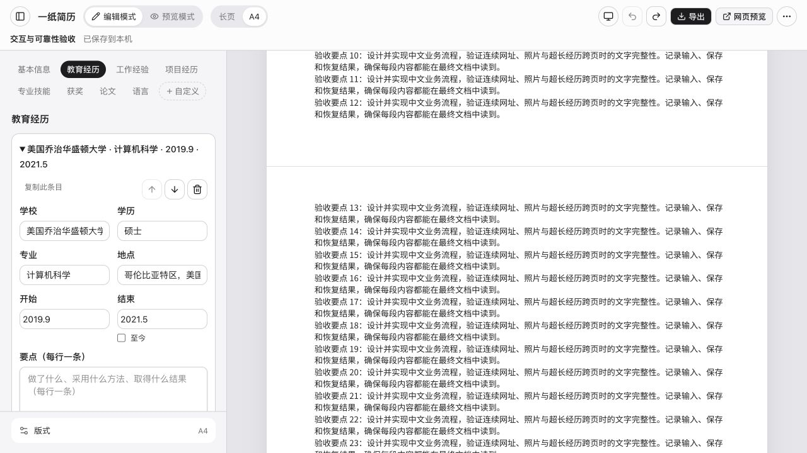

# 2026-10-03 分页与键盘焦点复查

[验收索引](README.md) · [当前待办](../ux-plan.md) · [上一阶段](2026-10-03-interaction.md)

在原有未提交改动上继续检查，基线仍为 `63d12b6`。本轮只更新本地代码与验收记录，未发布生产。

## 复现与修复

1. **删除后的焦点丢失**：在教育经历中用 Enter 删除第一项后，浏览器 `activeElement` 为 `BODY`。现在焦点移到下一条、上一条或删空后的添加入口；适用于普通经历、自定义区块及其嵌套条目、恢复点。移动到边界使按钮禁用后，焦点转到该条目的标题。权限拒绝删除、用户已移动焦点或列表已卸载时不抢焦点。恢复点操作另补对象与时间名称。
2. **A4 预览页界不一致**：沿用上一阶段 48 条中文要点、553 字符网址与照片的样例。修复前标为 5 页，纸张实际高 4294.02 CSS px。原因包括折叠边距重复累计、跨页缺少页边距，以及超长经历作为完整块测量。
3. 现在按真实内容间距测量，普通条目整体保留，超长经历按要点拆分；连续标题与第一条内容一起换页。占位补足页边距，白纸覆盖所有页。打印直接在下一段内容上分页，隐藏预览占位。

## 自动化与构建

最终 `pnpm check`：**14 个文件、125 项测试通过**，类型检查、生产构建、体积检查均通过；`git diff --check` 通过。

新增 14 项回归涵盖：删除首条 / 中间 / 末条 / 唯一条目、权限拒绝、避免抢焦点、移动到边界、自定义嵌套条目；连续标题绑定、不同预览缩放下的折叠边距、长经历按要点拆分与页边距、不可拆大段落；隔离打印副本保留实际分页标记并在打印结束后清理。

| 产物 | 当前 | 原预算 |
| --- | --- | --- |
| 公共入口及共享依赖 | 313.60 kB | ≤450 kB |
| 编辑器累计脚本 | 594.54 kB | ≤600 kB |
| 编辑器累计 gzip | 192.39 kB | ≤200 kB |
| 最大单脚本 | 399.06 kB | ≤500 kB |
| CSS | 52.50 kB / gzip 10.72 kB | 单独报告 |

## 实际浏览器结果

使用生产预览 `http://127.0.0.1:45223/` 与上一阶段同一验收稿。

- Enter 删除“美国乔治华盛顿大学”后，焦点位于“哈尔滨工业大学”的 `SUMMARY`；撤销后原数据恢复。把后者移到第一项，焦点仍位于该条目标题；已撤销测试排序。
- 复杂 A4 预览为 **4 页**，宽 **793.695 CSS px**，高 **4490.078 CSS px**，等于 4 张 A4 的高度。
- 后续页从“验收要点 13”“验收要点 40”和“ETDC 数字化工作台”开始，相对纸张顶端分别为 **1178.00、2300.51、3429.48 CSS px**；48 条编号要点仍完整。
- 几何检查中，栏目标题、条目头与要点没有跨越物理页界。第一页尾与第二页首的空白及边界见下图。
- 切回长页后为 1 张长纸，分页占位、打印起始标记和超长标记均清除。
- 320×720 下导出窗口宽 288px、左右各留 16px，文档滚动宽度仍为 320px。原稿保持长页，临时 A4 副本为 4 页；取消后焦点回到“导出简历”。
- 同尺寸下实际切到 A4 预览，纸宽 288.00px、高 1629.26px，高宽比例等于 4 张 A4；没有横向溢出，标题、条目头与要点仍无跨页界。检查结束已恢复桌面视口。
- 浏览器日志未见警告或错误。测试删除与排序均已撤销，保存格式恢复为长页。

## 验收边界与下一步

这里的 **4 页是网页预览结果**。本轮未重新操作原生打印窗口，未生成最终 A4 PDF，也未重复下载长页 PDF；上一阶段长页 PDF 的证据保持为历史记录。

- 最终 A4 PDF：在浏览器打印窗口选 A4、100%、关闭页眉页脚后保存，逐页核对 01–48、网址、照片、尾部栏目、页尾标题与空白页。
- 单个要点 / 段落本身超过一整页，仍依赖浏览器自然分页；界面会提示检查最终打印，预览不保证逐行分页一致。
- 实际 200% 浏览器缩放、三类系统辅助显示偏好全流程、iOS / Android 真机、完整屏幕阅读器流程及实体打印仍待独立验收。

上述项目均未用单元测试或桌面窄屏代替，顺序见 [当前待办](../ux-plan.md)。
