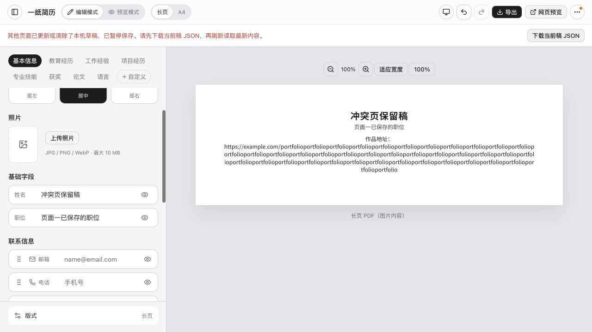
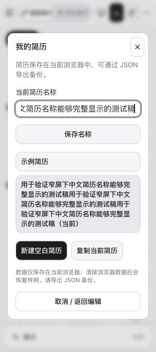

# 2026-10-03 保存可靠性与窄屏布局验收

[文档首页](../../README.md) · [验收索引](README.md) · [当前计划](../ux-plan.md)

基线提交为 `63d12b6`，并保留开始时已有的 10 个文件精简改动。本轮在本地执行，未发布生产。浏览器验收使用独立端口 `127.0.0.1:45222`，新建测试稿，不修改原示例内容。

## 检查发现与修复

- 保存原来直接覆盖整份工作区，旧页面的延时保存、切换或关闭可能覆盖另一页已保存的新版本。初始化现在保留原始记录快照，所有写入口比较快照，成功后才推进；收到其他页面更新或清空通知即暂停写入。
- 冲突保留当前内存稿，编辑页直接显示提示和 JSON 备份入口；独立预览的错误页也能下载当前稿。普通存储错误可重试，冲突状态需要备份后刷新，不提供强制覆盖。
- 原本只显示在菜单里的保存错误提升到页面提示。修复浅色背景变量自引用。
- 320px 视口下，较长中文名称曾把管理弹窗内容撑到 1076px，按钮宽度达到 1044px。修复后弹窗可视宽度与滚动宽度均为 288px，名称自动换行；恢复点操作也允许换行。
- 简介中的超长连续网址曾使 794px 的简历纸张产生 1442px 的内容宽度。增加纸张内换行后，两者均为 794px，导出文件保留完整网址。

## 自动化

`pnpm check` 通过：9 个测试文件、83 项测试，类型检查、生产构建和体积预算通过。比开始时增加 7 项回归：

1. `storage` 事件送达前也能阻止旧页覆盖；关闭旧页不覆盖新稿。
2. 外部更新立即提示；阻止导入、恢复、删除恢复点、新建、切换、命名后保存及离页保存。
3. 其他页面清空记录后，不重新写回旧内容。
4. 忽略主题偏好、其他存储区域和已过时的事件。
5. 初始化读取后、Hook 挂载前出现的新记录不会被覆盖。
6. 配额失败不推进快照，释放容量后可继续保存。
7. 首次示例下载期间出现的其他页面草稿不会被样例覆盖。

编辑器累计脚本 **563.49 kB / gzip 180.81 kB**，单个最大脚本 **496.65 kB**，CSS **51.97 kB**。全部预算通过，但单脚本已接近 500 kB，后续增加功能前应考虑拆分入口。

`git diff --check` 及文档本地链接检查通过。

## 生产构建浏览器回归

先在开发页面复现问题，最后重建并切换到生产预览，重新加载后实际验证：

- 刷新恢复姓名、职位和完整长网址；编辑 / 预览方向键切换、独立网页预览、返回编辑正常。
- 320px 视口下独立预览的页面滚动宽度等于视口宽度；管理弹窗的长中文名称完整换行。
- 联系信息可用方向键排序，状态提示“已移动到第 2 项”；管理弹窗按 Escape 关闭后焦点回到“更多操作”。这些检查不代表完整屏幕阅读器验收。
- 打开两个页面，第一页面修改并保存后，第二页面立即提示暂停保存。在第二页面继续输入测试姓名，下载 JSON 后关闭；刷新第一页面，仍保留第一页面的新版本。
- 解析冲突页下载的 JSON，确认它包含该页尚未保存的姓名和旧职位；正常页面的 JSON 保留当前姓名、职位、完整长网址和版式。
- 从导出面板切换长页格式，实际下载 PDF。文件 **53,954 字节、1 页、210 × 80 mm**；通过 Poppler 读取并渲染检查，中文与长网址完整，无横向裁切。
- 生产浏览器日志未发现错误或警告。下载事件监听超时，但文件已经落盘；结果以实际 JSON 解析、PDF 文件信息及渲染为依据。

保存冲突提示：

长名称管理弹窗：

## 边界与下一步

- 快照比较和 `storage` 事件属于乐观冲突检测，比较与写入不是跨页面原子事务；极端同时写入仍需独占写入或事务存储，也没有自动合并。
- 此次 PDF 检查仍是长页图片 PDF。复杂多页 A4 的系统最终输出、照片及中文字体组合、实体打印继续待验收。
- 未完成 iOS / Android 真机软键盘和触控、屏幕阅读器全流程、200% 浏览器缩放及减少动态效果设置下的完整验收。
- 完整离线、容量扩展和持久历史仍为后续增强。优先级与完成标准见 [当前计划](../ux-plan.md)。
